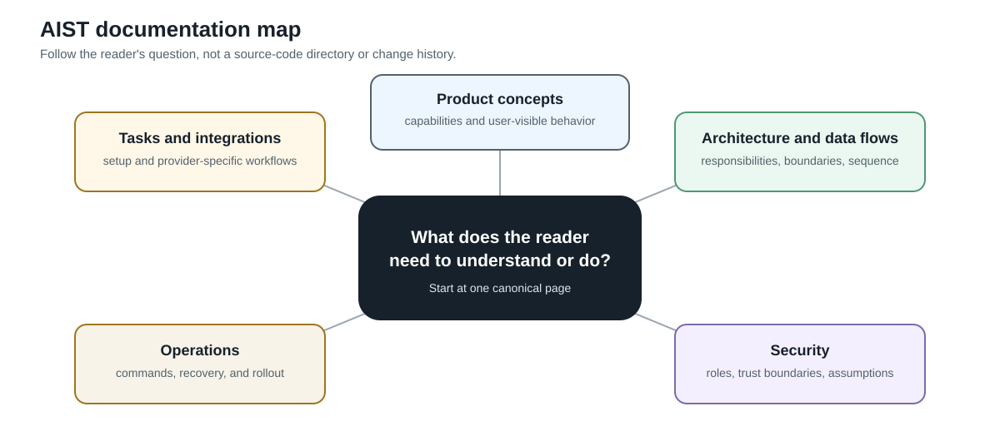

# AIST Documentation

This is the entrypoint to the AIST project reference. Choose the question you
need to answer, then follow the linked workflow or architecture page.

## Use AIST

- [Project and source onboarding](product/project-and-source-onboarding.md)
- [Organization](product/organization.md)
- [Pipeline execution](product/pipeline-execution.md)
- [Finding review](product/finding-review.md)
- [AI triage](product/ai-triage.md)
- [Work-item links](product/work-item-links.md)
- [Pipeline actions](product/pipeline-actions.md)
- [Scheduled pipeline launches](product/scheduled-pipeline-launches.md)
- [Canonical deduplication](aist-canonical-dedupe.md)

## Configure an integration

Integration pages document one external system's credentials, quirks, and
setup flow. Product pages above describe the general mechanism (import a
repository, link a work item, run an action); these pages cover the
provider-specific detail.

- [GitHub](integrations/github.md) — SCM source and work-item provider
- [GitLab](integrations/gitlab.md) — SCM source and work-item provider
- [Gerrit](integrations/gerrit.md) — SCM source
- [Gitea](integrations/gitea.md) — SCM source
- [Jira](integrations/jira.md) — work-item provider
- [YouTrack](integrations/youtrack.md) — work-item provider (no sync backend yet)
- [Linear](integrations/linear.md) — work-item provider (no sync backend yet)
- [Azure DevOps](integrations/azure-devops.md) — work-item provider (no sync backend yet)
- [Slack](integrations/slack.md) — pipeline action handler
- [VPN](integrations/vpn.md) — shared routing for internal-network integrations

## Understand the platform

Architecture pages describe one internal component or runtime responsibility at
a time. They are linked here after their supporting data flows have been
reviewed.

- [Platform building blocks](architecture/platform-building-blocks.md)
- [SAST pipeline runtime](architecture/sast-pipeline-runtime.md)
- [Runtime deployment](architecture/runtime-deployment.md)

## Follow data

Data-flow pages trace one trigger to one durable outcome. They are the basis for
the platform and security pages.

- [Source file access](data-flows/source-file-access.md)
- [AI triage execution](data-flows/ai-triage-execution.md)
- [VPN-routed operations](data-flows/vpn-routed-operations.md)

## Assess security

- [Tenant isolation and access](security/tenant-isolation-and-access.md)
- [Threat-model scope](security/threat-model-scope.md)
- [Threat register](security/threat-register.md)

Security pages describe trust boundaries and the threat model after the
corresponding product and data-flow pages have been verified.
