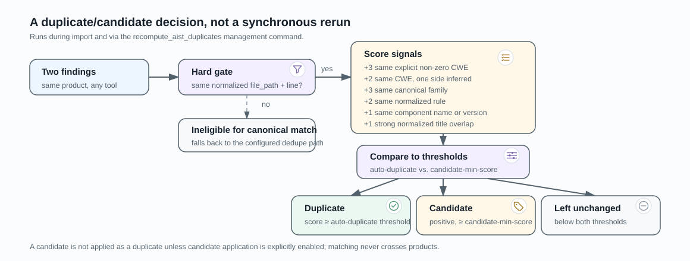

# Canonical Deduplication

Canonical deduplication compares scanner findings that point to the same source
location in the same product. It either links a finding to a duplicate root,
marks it as a review candidate, or leaves it unchanged.



## Strategy
- Keep UI-friendly titles, but make dedupe inputs stable.
- Use cross-scanner canonical matching with a strict hard gate: same normalized `file_path` and `line`.
- The current duplicate/candidate thresholds are configurable through
  `AIST_CANONICAL_AUTO_DUPLICATE_THRESHOLD` and
  `AIST_CANONICAL_CANDIDATE_MIN_SCORE`.

## Family Mapping
| Family | Typical Patterns | CWE fallback |
| --- | --- | --- |
| `private_key` | `private key`, `rsa key` | `321` |
| `aws_key` | `aws key`, `access key`, `AKIA...` | `798` |
| `hardcoded_secret` | `hardcoded secret/password/token` | `798` |
| `ssl_verification` | `ssl verify`, `no verify`, `tls verify` | `295` |
| `weak_hash` | `md5`, `sha1`, `weak hash` | `327` |
| `path_traversal` | `path traversal`, `directory traversal` | `22` |
| `open_redirect` | `open redirect`, `javascript/OR` | `601` |
| `xss_dom` | `xss`, `dom xss`, `cross site scripting` | `79` |
| `eval_dynamic_code` | `eval`, `dynamic code` | `95` |
| `command_injection` | `command injection`, `os command` | `78` |
| `sql_injection` | `sql injection`, `sqli` | `89` |
| `postmessage_origin` | `postmessage`, `origin check` | `346` |

## Scoring
- `+3` same non-zero CWE
- `+3` same canonical family
- `+2` same normalized rule
- `+1` same component name or version

Decision uses the configured thresholds. A score at or above the auto threshold
becomes a duplicate; a positive lower score at or above the candidate threshold
becomes a candidate. A candidate is not a duplicate unless candidate application
is explicitly enabled.

## Runtime Dedupe Config
Findings without a normalized path and line are ineligible for canonical
matching and can use the configured fallback deduplication path.

## Management Command
- Command: `recompute_aist_duplicates`
- Modes:
  - `--dry-run`
  - `--apply`
- Filters:
  - `--pipeline-id`
  - `--product-id`
  - `--since YYYY-MM-DD`
  - `--limit`
  - `--clear-existing-aist-duplicate-tags`

### Examples
```bash
python3 manage.py recompute_aist_duplicates --dry-run --product-id 12 --since 2026-01-01
```

```bash
python3 manage.py recompute_aist_duplicates --apply --pipeline-id 5ae48a36
```

## Boundaries and limitations
- The hard gate requires both path and line.
- Matching is grouped within one product; findings from different clients are
  never compared by canonical deduplication.
- Candidate tagging does not mutate duplicate links unless explicitly applied.

## Implementation references

- [Signature and score calculation](../aist/dedupe/canonical.py)
- [Decision application and fallback](../aist/dedupe/custom.py)
- [Recompute command](../aist/management/commands/recompute_aist_duplicates.py)
