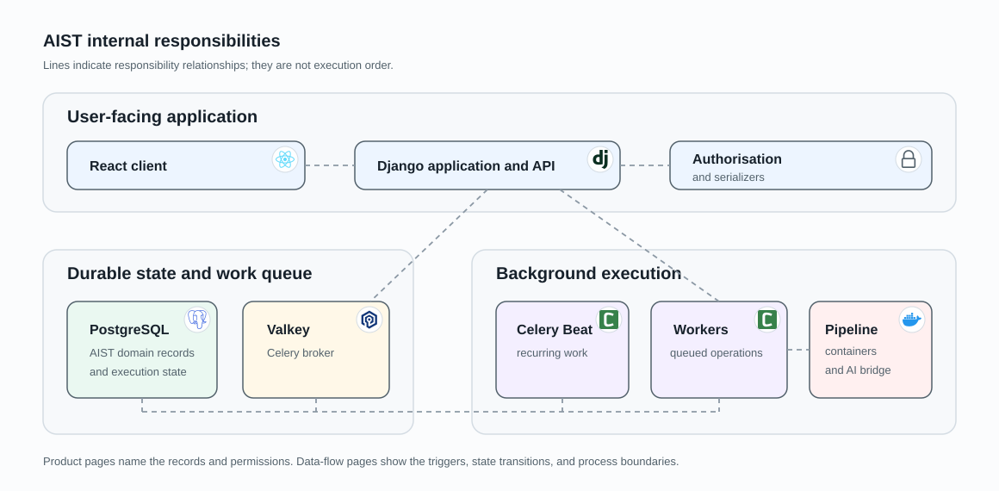

# Platform building blocks

AIST separates product interaction, durable coordination, asynchronous work,
and execution support. The diagram is the map; the sections below explain the
responsibility of each block and the meaning of the arrows between them. For
the concrete Compose services, see [runtime deployment](runtime-deployment.md).

## Blocks in the diagram

| Block | Owns | Does not own |
|---|---|---|
| React client | Product interaction and presentation | Authorization or durable workflow state |
| Django control plane | Authentication, authorization, validation, workflow transitions, and APIs | Long-running scan execution |
| PostgreSQL | Tenant, product, launch, pipeline, finding, review, and integration state | Task delivery |
| Valkey | Celery task transport | Product history or execution outcome |
| Celery Beat | Recurring task production | Execution of the task |
| Celery workers | Delayed operations, retries, orchestration, and persistence of outcomes | Browser/API request handling |
| SAST runtime | Workspace preparation, build, analyzer fan-out, and report production | Tenant admission or finding review |
| Provider connector | One standalone provider execution, such as DAST | SAST analyzer fan-out |
| Context extractor | Read-only source analysis tools for an authorized active pipeline | Source ownership or pipeline admission |
| Local AI bridge | Isolated local CLI invocation through a Unix socket | AI verdict persistence or tenant authorization |

## Request and state path

The solid request path begins at the React client and enters Django. Django
resolves every tenant-owned object inside the caller's authorized queryset,
validates the operation, and changes PostgreSQL in a transaction. A browser
identifier alone never selects a cross-tenant object.

PostgreSQL is therefore the source of truth represented by the green block.
Valkey carries the purple queued-work path, but a delivered or repeated broker
message is not itself a durable product transition.

## Background-work path

Interactive requests enqueue work through Django; recurring work starts at
Celery Beat. Workers consume both forms, re-read the durable object they are
about to operate on, and persist the observable outcome back to PostgreSQL.

This path owns repository discovery, source acquisition, pipeline execution,
report import, integration validation, work-item synchronization, and cleanup.
Durable launch requests keep admission and capacity waiting separate from an
already-created pipeline.

## Execution and analysis boundaries

The dashed arrows leave ordinary application processing:

- the worker calls the shared execution package, whose registry selects a SAST
  run or a standalone provider;
- a SAST run creates its workspace, builder, and analyzer containers;
- a standalone run creates a connector that communicates with its external
  provider;
- the local AI bridge creates an isolated CLI operation;
- that AI operation can use context-extractor tools, which resolve the active
  pipeline through the internal API and read its workspace through a read-only
  mount.

The execution package runs inside the worker rather than as a long-lived
service. Its operation containers do not decide who may access a project. They
receive a pipeline identity that has already passed admission, and their results
become product state only through the platform import or callback boundary.

## Follow one operation

For a manual SAST run, follow React → Django → PostgreSQL/Valkey → worker → SAST
runtime → PostgreSQL. For local AI triage, continue worker → local AI bridge →
context extractor → callback → PostgreSQL. This is why the diagram keeps
coordination blocks separate from execution blocks even when they run on the
same host.

The sequence inside one pipeline is described in
[pipeline execution](../product/pipeline-execution.md). The shared execution
boundary is described in [pipeline execution runtime](sast-pipeline-runtime.md).
