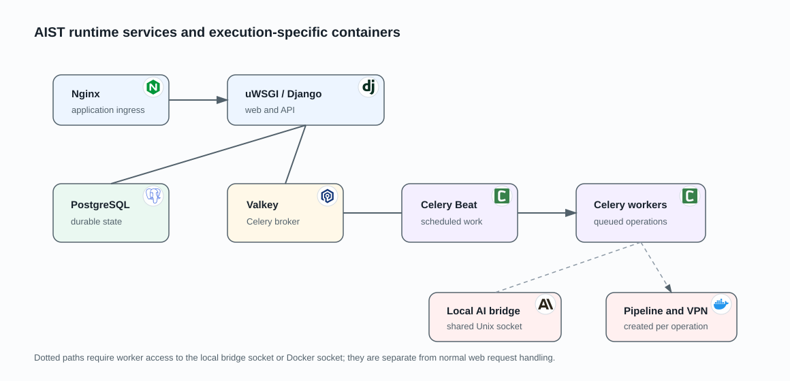

# Runtime deployment

AIST runs as a Docker Compose application. The diagram distinguishes long-lived
services from containers created for one operation. This matters operationally:
the context extractor and local AI bridge must be healthy before AI-assisted
work can complete, even though neither serves browser traffic.

## Long-lived services

Nginx is the application entry point. It serves or proxies browser and API
traffic to the uWSGI/Django service. Django authenticates the request, applies
the product workflow, reads or writes PostgreSQL, and publishes background work
through Valkey.

The long-lived deployment contains:

| Service group | Runtime responsibility |
|---|---|
| Nginx and uWSGI/Django | Browser/API ingress, authorization, and control-plane workflow |
| PostgreSQL and Valkey | Durable product state and Celery delivery |
| Celery Beat and workers | Recurring production and asynchronous execution |
| Context extractor MCP | Authenticated, read-only analysis of active pipeline workspaces |
| Local AI bridge | Unix-socket API that creates isolated local AI CLI runs |

The context extractor calls the internal platform API to resolve a pipeline to
its source root. Its project-workspace mount is read-only. The bridge has the
repository and workspace mounts it needs to launch the CLI, but it does not
write AI verdicts directly into browser responses; completion returns through
the application boundary.

## State and queued work

PostgreSQL stores the durable product and execution state used by both Django
and workers. Valkey transports Celery tasks. Celery Beat publishes recurring
tasks to the same broker, and Celery workers consume them.

The database, not the broker or worker process, determines the lasting state of
a launch, pipeline, finding, or integration. This lets the application expose a
consistent history when a task is retried or a worker restarts.

## Per-operation containers

Celery workers have Docker-daemon access for SAST, connector, and VPN
containers. The local AI bridge also has Docker-daemon access because it starts
the isolated CLI container. The web process and context extractor do not have
that socket.

Workers reach the bridge through a shared Unix socket. SAST runs create a
workspace plus builder and analyzer containers. A standalone provider run
creates its connector. When private connectivity is selected, that operation
also receives an execution-specific VPN sidecar or a warm scoped proxy.

The shared pipeline execution package is loaded by the workers; it is not an
additional long-lived Compose service. Its registry selects the SAST runtime or
standalone-provider runtime that creates the operation containers.

Selecting a VPN route is fail-closed: if its usable configuration is absent,
the operation fails instead of silently using the host's direct route.

## External boundaries

SCM systems, work-item providers, notification services, AI webhooks, and DAST
gateways are outside the Compose deployment. The owning integration determines
credentials and, where supported, the organization VPN route. Returned reports
and callbacks re-enter through a validated platform boundary before they become
durable state.

## Scaling and trust

Web and worker replicas may share PostgreSQL and Valkey, but every replica must
use the same application configuration and database schema. Capacity for
long-running execution must leave workers available for dispatch, cancellation,
cleanup, and unrelated pipelines.

The Docker socket is a privileged host boundary: workers and the local AI
bridge can control containers on that host. Production deployments should
isolate those services, restrict deployable images, and limit access to the
socket. See [security boundaries](../security/threat-register.md) and
[pipeline execution runtime](sast-pipeline-runtime.md).
