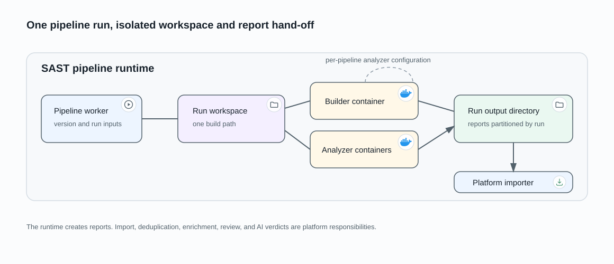

# Pipeline execution runtime

The `sast-pipeline` package is the worker's container-execution boundary for
SAST and standalone providers such as DAST. It is not a separate long-lived
service. AIST owns durable authorization, admission, lifecycle state, and result
import; the package owns provider invocation, operation-container cleanup, and
bounded runtime outcomes.

## Hand one durable execution to a worker

AIST first uses its execution-driver registry to validate the selected target,
acquire capacity, and persist an **Admitted** pipeline with a recoverable publish
intent. The broker message contains only the pipeline identity. A worker accepts
one matching delivery, moves the pipeline to **Executing**, and reconstructs the
frozen execution input from PostgreSQL.

This keeps tenant authority, credentials, parameters, and provider checkpoints
out of the broker payload. A duplicate or stale delivery cannot start an
unrelated execution.

## Select the runtime path

Inside the worker, the AIST driver selects the lifecycle behavior for the
pipeline type. The execution package then uses its own registry to invoke one
runtime path:

- **SAST** prepares the standard execution workspace and output directory, runs
  the builder, then fans out to the selected analyzer containers;
- **DAST** uses those same prepared paths, creates a connector container that
  starts or resumes one external provider run, and returns a bounded outcome
  plus its recovery checkpoint.

The builder prepares source and dependencies in a container selected for the
project. Analyzer containers then use the prepared workspace and the
per-pipeline analyzer selection derived from languages, time class, and launch
configuration.

When source acquisition needs a project VPN, the builder joins the
execution-specific VPN sidecar. Analyzer containers consume the prepared
workspace and do not automatically inherit that private network path.

The connector receives its command, its provider token, and its output directory
as owner-only files rather than environment variables, so the worker and the
container must agree on who that owner is. The worker hands ownership to the
unprivileged user the connector image declares; where it cannot, the container
runs as the worker instead. Neither path relaxes the file modes.

## Hand reports back to AIST

SAST analyzers write reports to the timestamped run output directory. When DAST
reaches a terminal outcome, the execution package atomically writes the report
from the typed connector result into the same product/version/pipeline/timestamp
layout and returns its path. AIST persists the provider checkpoint before it
reads and imports that file. The platform importer validates the selected
format, records tests on the pipeline, and creates or updates findings for the
effective project version.

After report hand-off and container cleanup, the report remains in durable
pipeline output while connector credentials and recovery files are removed with
the execution workspace. AIST owns deduplication, enrichment, regression
detection, review, and AI triage.

## Recover without changing the boundary

The launch reconciler repairs stale dispatcher claims, durable publish intents,
and execution leases from PostgreSQL. If an accepted DAST task disappears while
the provider outcome remains recoverable, AIST republishes the same generic task
with the stored checkpoint. A lost SAST task cannot safely resume midway and
finishes with warnings instead.

A connector that fails before it reaches the provider — an unreadable command
file, an unusable token, an output directory it cannot write — is not a provider
outage: the next attempt would fail identically. AIST ends such a pipeline at
once with its own outcome code instead of retrying it.

What ends an external provider run is silence, not duration. A run that keeps
delivering — a run identity, further log output — is left alone however long it
takes, and its capacity lease is renewed while its worker holds it. A run that
delivers nothing for longer than a working one would is ended. A separate ceiling
on total run length is a safety limit a healthy scan does not reach; either bound
may be configured off and the other still applies.

Before a run is abandoned for either reason, the provider is asked once more
whether it has become terminal, and a result that exists by then is imported
through the same validation and finalization path as any other.

Containers and temporary paths remain scoped to one pipeline. SAST cancellation
stops local work immediately. DAST cancellation persists intent first, then the
connector carries the stop request across the provider boundary until a terminal
outcome is observed.

See [pipeline execution](../product/pipeline-execution.md) for the user-visible
lifecycle and [VPN-routed operations](../data-flows/vpn-routed-operations.md)
for the conditional network path.
