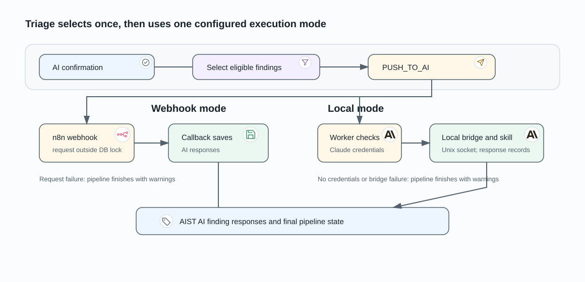

# AI Triage Execution

AI triage begins only after imported findings reach the AI confirmation stage.
The pipeline selects eligible active findings, records the transition to
`PUSH_TO_AI`, and sends the selected identifiers through the configured triage
mode. A completed verdict is stored as an AIST AI finding response.

## Select the findings once

Manual triage validates the selected finding identifiers against the pipeline
and its current state. Automatic triage uses the launch-data filter snapshot,
the selected triage type, and active findings from the pipeline's tests.
Findings already carrying an analyzer-produced AI response are excluded from
post-import selection. A selection of zero findings finishes the pipeline
without an AI request.

## Webhook triage

Webhook mode sends the project summary, selected finding identifiers, pipeline
identifier, and callback URL to the configured n8n webhook. The request is
made outside the database transaction. After an accepted request, the pipeline
is changed to `WAITING_RESULT_FROM_AI`; the callback persists the responses.
A request failure finishes the pipeline with warnings.

## Local triage

Local mode first obtains the active Claude integration credentials for the
project. If none is available, it finishes with warnings without contacting the
bridge. Otherwise the worker sends an asynchronous request over the shared Unix
socket to the local triage bridge, which runs the configured triage skill
against the resolved source path. The skill writes AIST AI finding responses;
the local callback finalises the pipeline. If the bridge reports an error after
responses already exist, the callback retains those responses and completes
without a degraded final state.

## Durable outcome

Each response is associated with a pipeline and finding and stores the verdict
and related triage fields. The [finding review](../product/finding-review.md)
page explains how a reviewer uses the resulting verdict; the verdict does not
replace the finding's review controls.
