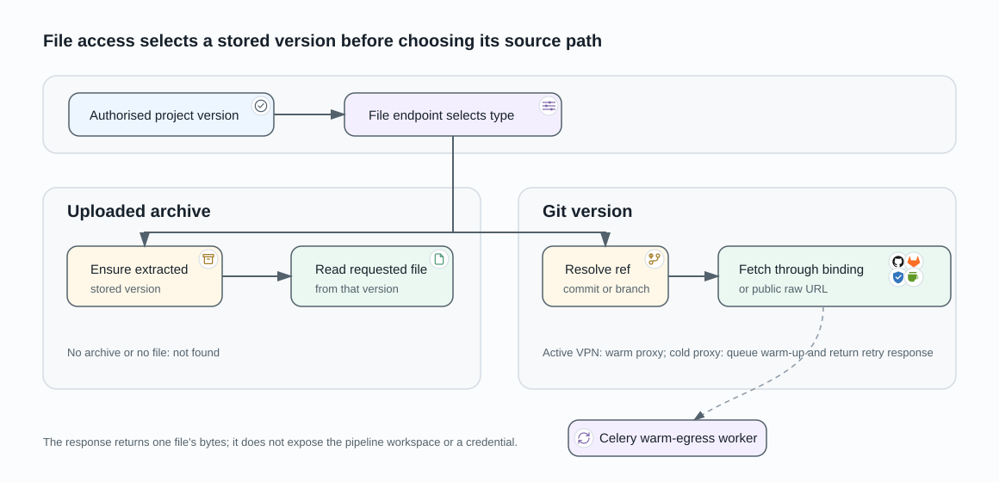

# Source File Access

This flow returns a single source file to an authorised AIST user. It has two
storage paths: an uploaded archive is read from its extracted project-version
directory; a Git version is fetched from its repository at the selected ref.

## Start with an authorised version

The file endpoint resolves the requested project version from an authorised
project-version queryset with product view permission. The requested path is
used only after that version is selected. A caller cannot choose a VPN tunnel,
repository binding, or organization by request parameter.

## Read an uploaded archive

For a `FILE_HASH` version, AIST extracts the stored archive on the first file
request and reads the requested file from that extracted version. If the
version has no archive or the requested file is unavailable, the endpoint
returns not found.

## Fetch a Git version

For `GIT_BRANCH`, the endpoint uses the last resolved commit when present and
otherwise the configured branch. For `GIT_HASH`, it uses the stored version
value. It uses the repository binding to obtain provider-specific raw content,
or the public raw-file URL when the project has no binding. A pipeline workspace
is never used for this request because pipeline workspaces are per-run and
ephemeral.

## Route VPN-protected source access

For a repository whose source access resolves to an active VPN integration,
the web process sends the fetch through a warm HTTP CONNECT proxy. A Celery
worker starts or reuses one warm sidecar per VPN integration; the UI can ask to
prewarm it when findings become visible. If a fetch reaches a cold proxy, the
endpoint queues a warm-up and returns `202` with a retry interval. Public
repositories use no proxy.

The warm egress pool is distinct from the short-lived VPN sidecar created for
a pipeline run. Idle warm sidecars are reaped, and the pool also enforces a
maximum count.
