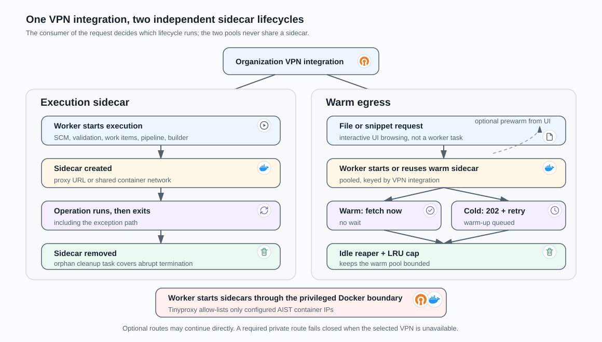

# VPN-Routed Operations

An AIST VPN integration gives one client’s private systems a controlled AIST
route. The platform uses two separate lifecycles: an execution sidecar for
worker operations and warm egress for interactive source-file access. See
[VPN integration](../integrations/vpn.md) for the credential and
configuration detail behind this data flow.

## How AIST chooses a VPN

A VPN integration belongs to one organization. An SCM integration or work-item
provider can reference that organization’s VPN; source-file access first uses
the VPN attached to its SCM integration and then falls back to the project’s
resolved VPN configuration. A cross-organization SCM/VPN binding is ignored.
Without an active VPN, the operation continues directly.

## Operation sidecar

Workers use an execution-specific sidecar for SCM discovery/import, integration
validation, work-item synchronization, pipeline source acquisition, and builder
container access. HTTP clients receive its proxy URL; pipeline builders share
its network namespace. The sidecar is removed when the operation exits,
including an exception path.

This is not reused by UI browsing. A missing active VPN means direct execution;
missing VPN credentials prevent the worker from starting a required sidecar.

## Warm egress for source files

The web process never creates containers and does not wait for OpenVPN startup
during a file request. From an authorized project version it derives the warm
proxy address. A worker starts or reuses one warm sidecar per VPN integration;
the findings UI can prewarm it before snippets are requested.

For a cold proxy, the endpoint queues warming and returns `202 warming` with a
retry interval. Prewarm is best-effort: failure does not break the UI, and a
later blob request repeats the warm-up path. The warm pool is separate from
pipeline sidecars, keyed by VPN integration, reaped when idle, and capped by
least-recently-used eviction.

## Security and cleanup boundary

VPN configuration and credential fields are encrypted at rest. To start a
sidecar, worker memory decrypts and passes them to Docker as base64-encoded
environment values. Docker socket access is therefore a high-privilege boundary.
Tinyproxy accepts only configured AIST container IPs; it is not a public proxy.
The periodic cleanup task removes orphaned execution sidecars when an abrupt
worker termination bypasses normal cleanup.

## Implementation references

- [Sidecar lifecycle](../../aist/utils/vpn.py)
- [Warm egress selection and pool](../../aist/integrations/egress.py)
- [Interactive blob endpoint](../../aist/api/files.py)
- [Pipeline VPN attachment](../../aist/tasks/pipeline.py)
- [Prewarm and reaper tasks](../../aist/tasks/egress.py)
