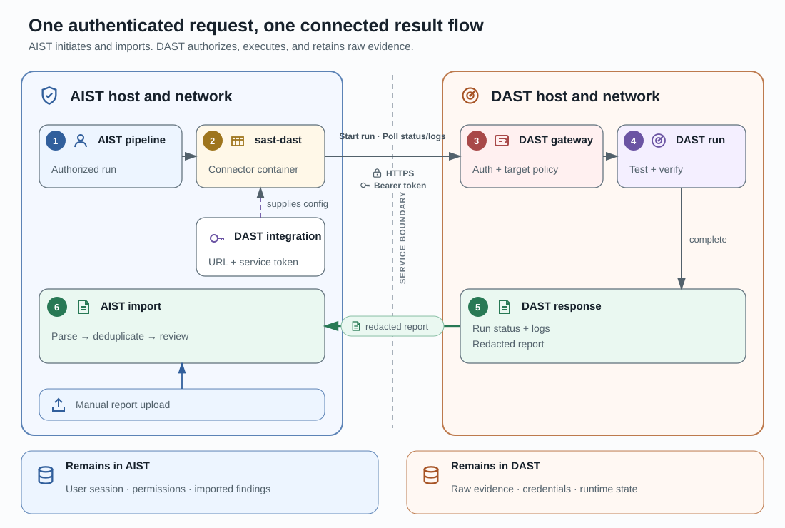

# DAST integration

The DAST integration connects one AIST organization to an external DAST
gateway. It supports autonomous scans and manual result import without making
DAST part of the SAST analyzer fan-out.

## Responsibility boundary

| AIST owns | DAST owns |
|---|---|
| Organization access, project binding, launch admission, and pipeline history | Target policy, target-side execution, and provider progress |
| Encrypted integration credential and synchronized capability snapshot | Gateway authentication and the provider contract |
| Result identity validation, import, deduplication, and finding review | Raw evidence, terminal result, and report production |

The products do not share users, sessions, credentials, or a database. The DAST
gateway is an external HTTPS boundary, optionally reached through the VPN
selected on the DAST integration.

## Configure the integration

1. Import the provider-generated onboarding bundle into the organization.
2. Select an organization VPN when the gateway is on a private network.
3. Validate gateway connectivity and credentials.
4. Synchronize the provider's targets and capabilities.
5. Bind an eligible target and source identity to one AIST project.
6. Create a DAST launch configuration from the enabled binding.

Only one DAST integration is active for an organization at a time; disabled
records remain as history. The service token is write-only after import.

Because that token cannot be read back, changing the stored connection — gateway
URL, CA bundle, integrator identity, or fingerprint — requires a bundle that
carries the matching token. The name and the VPN route can be changed on their
own, without a bundle.

Replacing the connection or moving the integration to a different route
revalidates it, so the integration is not ready again until the new probe
succeeds. A rename cannot change what a probe would reach, so a ready
integration stays ready through it.

## Readiness

A launch is ready only when the integration is healthy, synchronized
capabilities are current, the project binding is enabled, the parameter set is
valid, autonomous execution is allowed, and a private gateway has its explicit
DAST VPN route.

The same readiness result is shown during configuration and checked again when
execution is admitted. A stale capability revision or changed provider schema
must be reviewed before the binding becomes ready again.

## Autonomous execution

An authorized start enters the normal durable launch lifecycle. After admission,
an AIST worker starts the standalone DAST connector. The connector starts and
observes the provider run, while AIST retains cancellation intent, pipeline
state, and the final import decision.

Before importing a terminal result, AIST verifies the expected provider run,
target binding, source revision, result format, and nested report. Invalid,
ambiguous, or oversized results fail before findings are persisted.

## Manual result import

A DAST result produced outside AIST can be imported without contacting the
gateway. A user with project-operate permission selects an enabled binding,
uploads the terminal result, reviews its validation preview, and confirms the
import.

AIST derives the source revision from the selected binding rather than accepting
an unrelated commit from the client. Confirmation creates an import pipeline
and applies the same result validation and finding lifecycle used by an
autonomous result.

## Network and credentials

Private DAST traffic uses only the VPN attached directly to the DAST
integration; project and SCM VPN configuration does not substitute for it.

Every gateway URL must be an absolute HTTPS URL with no credentials, query, or
fragment, on port 443 or 8443; that much is enforced in every case. How far the
destination address can be checked in addition depends on which side resolves it
for the connection that follows:

- An address literal needs no lookup, so the address checked is the address used.
  It must be public, or — when the integration has an active VPN route — a
  standard private address. Loopback, link-local, and other special-purpose
  addresses are never accepted.
- A name on a direct connection is resolved by the platform and must be public,
  because that lookup is the one the connection uses.
- A name on a VPN-routed connection is resolved inside the tunnel, by the proxy
  that opens the connection. The platform cannot confirm that address from
  outside the tunnel: a VPN-internal name usually has no answer there, and an
  answer that does exist describes a different lookup than the connection makes.

For a routed name, then, the VPN route attached to the integration is what bounds
where the connection can land; give the route no more reach than the gateway
needs. The platform still refuses a routed name that it can already see resolves
to a loopback, link-local, or other special-purpose address. That is an early
rejection of an obvious misconfiguration, not a guarantee about the address the
connection finally uses.

A rejected destination fails before any connection is attempted. A failure of the
TLS handshake itself — an untrusted certificate, or a name the gateway will not
serve — is reported separately from an unreachable gateway, so the two are not
diagnosed as the same fault.

The service token and optional custom CA are loaded from the organization
integration when the connector starts. They are not launch parameters or
general broker payloads.

Use the [DAST operations runbook](../runbooks/dast-operations.md) for API
examples, cancellation, recovery, contract promotion, and token rotation. Use
the [staging compatibility canary](../runbooks/dast-staging-canary.md) before a
provider contract or deployment change is promoted.
