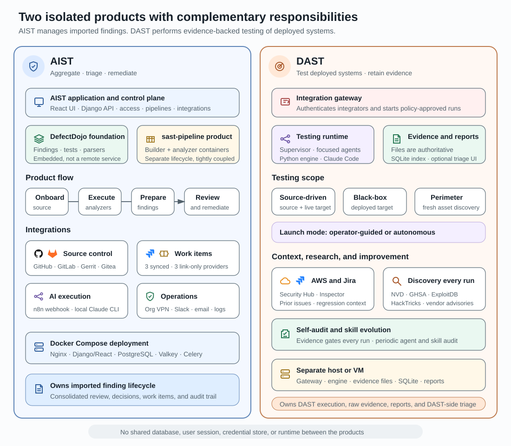

# AIST and DAST product architecture

This page gives a product owner the shortest useful view of two independently
deployed security products: what each one owns and how AIST starts an
autonomous DAST run. It is designed to be scanned in three to five minutes.

## AIST owns the analysis control plane

AIST onboards projects and source versions, admits manual or scheduled runs,
invokes security-analysis runtimes, imports their reports, correlates findings
across pipelines, and presents findings for human or AI-assisted review.

DefectDojo is embedded in the AIST application and supplies the underlying test,
finding, parser, and report-import foundation. The separately maintained SAST
pipeline package creates isolated workspaces and analyzer containers for one
admitted run.

## DAST owns target-side execution

DAST is deployed separately behind its own authenticated integration gateway.
See the [responsibility boundary](../integrations/dast.md#responsibility-boundary)
for what each product owns; neither shares a database, user session, credential
store, or runtime with the other.

## How one autonomous run crosses the boundary

1. **Admit the run.** An authorized user submits a one-off DAST launch or starts
   an enabled DAST launch configuration; AIST validates project authority,
   integration readiness, target capability, source compatibility, and
   execution capacity.
2. **Prepare provider execution.** AIST resolves the project binding and the
   provider's synchronized capability; credentials are not part of this
   durable request.
3. **Durable pipeline control.** AIST records dispatch, cancellation intent, and
   recovery state so the run survives a worker restart.
4. **DAST connector.** A short-lived worker container loads the gateway URL and
   service token from the DAST integration, then starts, observes, and can
   cancel the provider run — optionally through the VPN network selected on
   the integration.
5. **DAST integration gateway.** The gateway authenticates the connector's
   HTTPS request with its bearer token and returns progress and a typed
   terminal result.
6. **Host-side DAST runner.** The provider performs the target testing and
   produces the report behind the gateway.
7. **Validate identity and report.** AIST checks the returned run identity,
   source revision, and report format before importing tests and findings.

Cancellation and recovery cross the same connector-to-gateway boundary. AIST
owns the durable cancellation intent and pipeline outcome; DAST owns the actual
termination of target-side work.

## Manual results follow the same finding boundary

A DAST result produced outside AIST — the diagram's manual upload path — can be
imported against an enabled project binding without contacting the gateway. It
still validates the result identity, source revision, target binding, and
report format before creating the pipeline's tests and findings.

## Continue reading

- [Pipeline execution](../product/pipeline-execution.md) — the shared launch and
  finding lifecycle
- [AI triage](../product/ai-triage.md) — how a finding gets a verdict, and which
  backend runs it
- [DAST integration](../integrations/dast.md) — configuration, readiness, and
  the autonomous-execution operational detail
- [Pipeline execution runtime](../architecture/sast-pipeline-runtime.md) —
  generic dispatch, SAST analysis, and standalone-provider execution
- [Runtime deployment](../architecture/runtime-deployment.md) — where AIST
  services and operation containers run
- [DAST operations](../runbooks/dast-operations.md) — onboarding, launch,
  cancellation, and recovery
