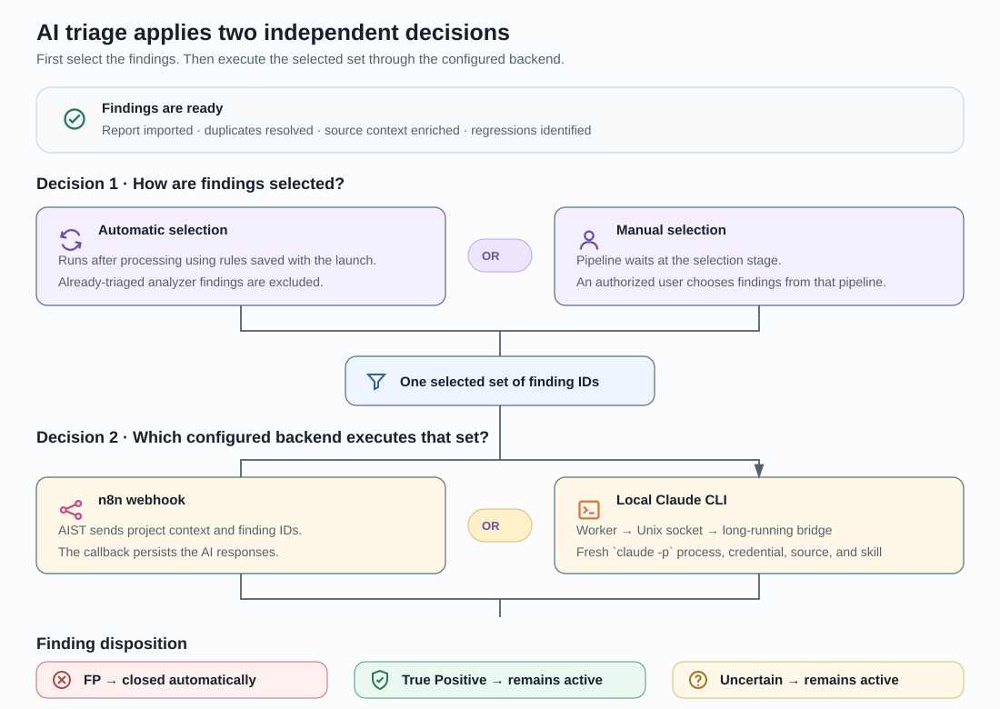

# AIST and DAST product architecture

This page gives a product owner the shortest useful view of two independently
deployed security products: what each one owns, how AIST performs AI triage,
and how AIST starts an autonomous DAST run. It is designed to be scanned in
three to five minutes.

## 1. Two products with different responsibilities

### AIST product role and flow

**AIST aggregates, triages, and tracks remediation of imported findings.** It
onboards source projects, runs manual or scheduled pipelines, correlates results
across runs, performs AI triage, and provides a consolidated review surface.

### AIST building blocks

AIST is built from three closely related layers:

- the **AIST application** provides the UI, API, access control, pipeline
  workflow, AI triage, integrations, and work items;
- **DefectDojo is embedded directly into AIST** and provides tests, findings,
  parsers, and report import;
- **`sast-pipeline` is a separately maintained execution product** tightly
  coupled to AIST. It starts builder and analyzer containers, including the
  AIST-side connector for remote DAST runs.

### AIST deployment

AIST is deployed with Docker Compose: Nginx fronts React and Django, PostgreSQL
stores product state, Valkey carries Celery work, and workers create per-run
containers. A long-running Claude bridge supports local AI execution.

### DAST product role and testing scope

**DAST adaptively tests deployed systems.** It owns target policy, execution,
raw evidence, reports, and DAST-side triage. Its testing scopes are
**Source-driven**, **Black-box**, and **Perimeter**. Operator-guided and
autonomous execution are launch modes; AIST currently starts the autonomous
source-driven workflow.

### DAST context, discovery, and self-audit

Every healthy DAST run combines required and exploratory testing. Jira and
prior findings provide regression context; AWS Security Hub and Inspector
provide leads. The run also searches NVD, GitHub Security Advisories,
ExploitDB/Searchsploit, HackTricks, and vendor advisories, but reports only what
live verification confirms. Every run audits its evidence, coverage, decisions,
production safety, research, and report durability. Periodic agent and skill
audits turn confirmed gaps or techniques into tested improvements.

### DAST deployment

DAST runs on a separate host or VM. Its gateway accepts integration requests;
the supervisor, focused agents, and Python engine run tests. Files are the
evidence source of truth; SQLite is a derived index. Results are exposed as a
static report and optional Flask triage UI.

### Integration ecosystem

AIST integrates with source control, organization VPN routes, n8n or Claude
CLI, Slack/email, and work-item providers. Jira, GitHub Issues, and GitLab
Issues synchronize status; YouTrack, Linear, and Azure DevOps are link-only.
DAST uses AWS, Jira, and security-research sources as testing context. None of
these integrations creates shared product state or identities.

## 2. How AIST AI triage is selected and executed

AI triage begins after deduplication, enrichment, and regression processing.
Two independent decisions are applied:

1. **Selection trigger:** automatic selection applies launch-time rules and
   excludes findings with an analyzer-produced AI verdict; in manual mode an
   authorized user selects findings.
2. **Execution backend:** n8n webhook or local CLI, resolved independently from
   the launch override and then the project profile. Either selection trigger
   can use either backend.

The webhook sends project context and finding IDs to n8n and stores its
callback. Local execution uses `worker → Unix socket → claude-bridge`; the
bridge starts a fresh `claude -p` process with the project credential and source
path. The bridge container is reused, but CLI conversation state is not.

The verdict changes the finding lifecycle as follows:

- **False Positive:** AIST closes the finding, marks it false positive, and
  records the AI action;
- **True Positive:** the finding remains active for review and remediation;
- **Uncertain:** the finding remains active and requires human review.

Reviewers can later change the disposition. Work-item status is context only: a
ticket cannot close a finding or accept its risk.

## 3. AIST-to-DAST interaction and authorization

The `sast-dast` container runs inside `sast-pipeline` on the AIST host and
communicates with the DAST gateway on a separate machine. It authenticates over
HTTPS with the organization's Bearer service token. The gateway applies the
integrator and target policy before starting an isolated DAST run. While the
run is active, `sast-dast` polls its status and logs; when it finishes, the
container downloads the redacted report and passes it to the AIST importer.

There is no shared user session or database between the products. Their data
exchange is deliberately limited:

| Direction | Data |
|---|---|
| AIST → DAST | Scan request: target, tier, depth, source reference, and correlation ID |
| DAST → AIST | Run ID and status, bounded logs, and the redacted findings report |
| Remains in DAST | Raw evidence, target and AWS credentials, SQLite state, and Claude session data |

Manual import is independent: a user with project edit permission uploads a
report to AIST without a DAST token or runtime call. Its findings pass through
deduplication and enrichment and become available for optional manual AI
triage, review, and remediation.

## Local reference

- [AIST platform building blocks](../architecture/platform-building-blocks.md)
- [AIST runtime deployment](../architecture/runtime-deployment.md)
- [Pipeline execution](../product/pipeline-execution.md)
- [AI triage](../product/ai-triage.md)
- [Work-item links](../product/work-item-links.md)
- [DAST integration](../integrations/dast.md)
- [VPN-routed operations](../data-flows/vpn-routed-operations.md)
- [SAST pipeline runtime](../architecture/sast-pipeline-runtime.md)
