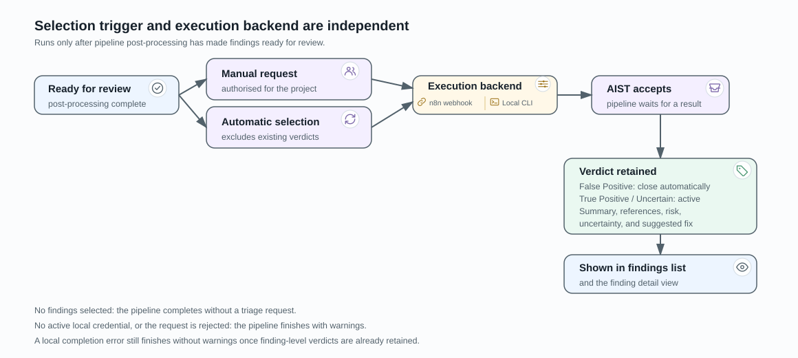

# AI Triage

AI triage adds a finding-level verdict to an imported pipeline result. It runs
only after pipeline post-processing has made findings ready for review. A
pipeline can request triage manually, or AIST can select eligible active
findings automatically from its recorded launch configuration.

## Select findings

A manual request is authorised against the pipeline's project and verifies that
each selected finding belongs to that project. Automatic triage selects active
findings after post-processing, applies the saved filter for the chosen triage
mode, and excludes findings that already have an analyzer-produced AI verdict.

The configured mode is resolved from the launch configuration first, then from
the project profile. AIST supports a webhook-based mode and a local bridge mode.
The selected mode and filter are part of the run's recorded configuration, so a
later project-profile change does not rewrite a completed run's selection.

## Receive and retain a verdict

When AIST accepts a triage request, the pipeline waits for a result. A result is
stored as one AI response per pipeline and one verdict per finding in that
pipeline. A verdict is `True Positive`, `False Positive`, or `Uncertain`; it can
include summary, references, risk scores, uncertainty values, and a suggested
fix. The findings list and detail view show the saved verdict.

## Failure behaviour

If no findings are selected, the pipeline completes without a triage request.
If the selected local mode has no active credential, or the request cannot be
accepted, AIST finishes the pipeline with warnings. A local completion callback
that reports an error still completes without warnings when finding-level
verdicts were already retained.
