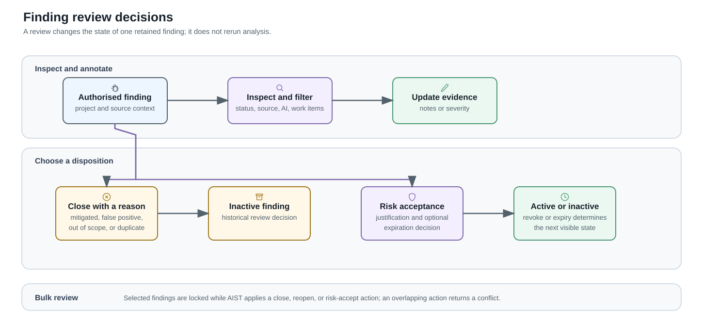

# Finding Review

Finding review records the decision made about an imported security result. A
user with access to the finding's project can filter the findings list, inspect
the finding and its source-version context, add review notes, and export the
record. Write actions require the corresponding finding permission.

## Review one finding

The detail view shows the finding's project, source version, file location,
severity, status, AI verdict when one exists, notes, and linked work items. A
reviewer can change severity or close the finding as mitigated, false positive,
out of scope, or duplicate.

Closing a duplicate also links it to a selected primary finding. The duplicate
is not triaged independently; follow-up belongs to the primary finding. A
reviewer can reopen a finding, returning it to an active state.

## Record risk acceptance

Risk acceptance is a separate decision from closing a finding. It requires a
justification and records the acceptance on the finding. The finding becomes
inactive while that approval is in effect. The reviewer can include an owner,
an expiration date, and whether expiry reactivates the finding. Revoking the
approval removes it and reactivates the finding.

## Review many findings

The findings list supports bulk close, reopen, and risk-accept actions. Every
bulk action requires a reason. A close action also requires one of the supported
close reasons. AIST locks the selected findings while it applies a bulk action;
it reports a conflict instead of applying overlapping changes.

## Relationship to later scans

The review decision belongs to the historical finding. When a later import
matches that finding through deduplication, AIST updates the existing record;
an unmatched re-detection becomes a new active finding for review. The
[Pipeline execution](pipeline-execution.md) page describes the import path.
