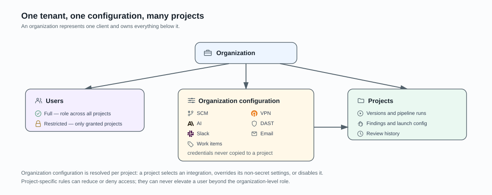

# Organization

An AIST organization represents one client. It is the tenant that owns that
client's users, projects, findings, integrations, work-item providers, and
configuration.

## Tenant contents

An organization owns its product type and AIST projects. Each project owns
source versions, pipeline runs, findings, launch configuration, and review
history. Organization configuration holds SCM, VPN, AI, DAST, Slack, and email
integrations, plus work-item providers. Credentials remain with the
organization configuration rather than being copied to projects.

## Users and projects

Users enter an organization through membership in its product type. Full
members receive their organization role across that client's projects;
restricted members receive only explicitly granted projects. Project-specific
rules for full members can reduce or deny access. Restricted members use their
explicit project grants as their actual capability, so a grant may be higher
than the baseline Reader membership; Owner grants retain the separate Owner gate.

The assignable AIST organization roles are Reader, Writer, Maintainer, and Owner.
An actor cannot change their own role or assign a role above their own effective
organization role. Removing a member clears that organization's project grants,
denials, and access-mode row and revokes the member's active personal tokens for
that organization. Tokens for other organizations are unaffected.

Projects resolve organization configuration by integration type. A project can
select a particular integration, override non-secret settings, or disable that
type. See [tenant isolation and access](../security/tenant-isolation-and-access.md)
and [project and source onboarding](project-and-source-onboarding.md).
