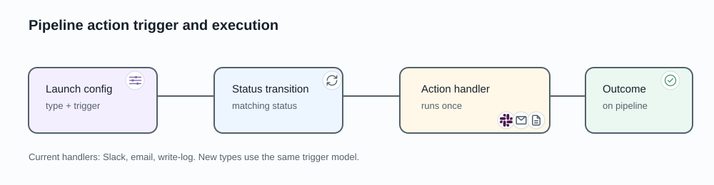

# Pipeline actions

A pipeline action performs a configured delivery operation when a pipeline
reaches a selected status. Actions belong to a saved launch configuration so
the same notification behavior can be reused across its runs.

## Configure an action

An action selects:

- the pipeline status that triggers it;
- a handler such as Slack, email, or write-log;
- handler-specific, non-secret options such as channels, recipients, title, or
  summary format.

Credentials remain in the organization integration and are resolved when the
action runs. They are not copied into the launch configuration.

When AIST accepts a launch request, it copies the action definitions into that
request's non-secret snapshot. Editing or deleting the saved launch
configuration later affects future launches, not the already accepted run.

## What happens at the trigger

1. The pipeline reaches the configured status.
2. AIST selects the matching actions captured for that run.
3. Each handler attempts its delivery and records success or failure on the
   pipeline.

AIST atomically claims one attempt for each action, pipeline, and trigger status.
Repeated status delivery does not deliberately invoke the handler again. The
record then changes from pending to performed or failed.

This is at-most-once application behavior, not a guarantee from an external
provider. If the process loses contact after sending but before observing the
response, AIST does not automatically repeat a delivery whose external outcome
is uncertain. An abrupt process stop can leave the attempt pending until an
operator reconciles it.

An action reports a pipeline event. It does not change the source version,
finding disposition, risk acceptance, or work-item status.

See [Slack integration](../integrations/slack.md) for Slack-specific setup.
