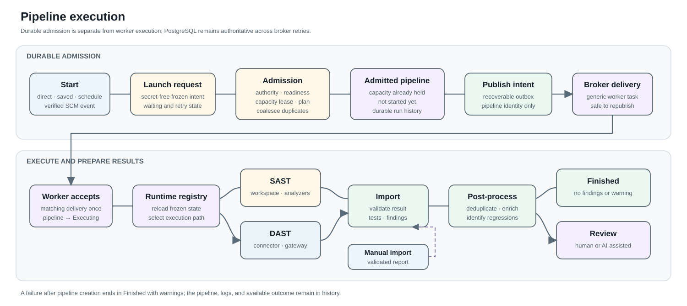

# Pipeline execution

A pipeline is the durable history of one admitted execution or one report
import. It connects the selected project and source version to progress, logs,
imported tests and findings, and any later AI responses.

## Start with durable intent

A run can begin from a direct user action, a saved launch configuration, a due
schedule, or a verified SCM event. Each of these paths first creates a launch
request. The request records what should run while AIST confirms that its stored
authority, configuration, and execution target are still valid.

A pipeline does not exist merely because a request is queued. Admission creates
the pipeline only after readiness and capacity checks succeed. Until then, the
launching view shows the request as waiting, superseded, cancelled, expired, or
failed without presenting it as a running pipeline.

## Execute the selected target

One launch configuration selects one execution target:

- **SAST** prepares an isolated source workspace and runs the configured builder
  and analyzer containers;
- **DAST** invokes a standalone connector while the external DAST product owns
  the target-side scan and raw evidence.

Both targets use the same AIST admission, pipeline control, cancellation intent,
and result-import boundary. Target-specific readiness and execution details stay
with the owning integration or runtime.

## Import a result

Completed analyzers and standalone providers return a report through the
platform import boundary. AIST validates the report, associates imported tests
with the pipeline, and associates findings with the selected project version.

A report produced outside AIST can also be imported manually. Confirmation
creates an import pipeline and skips analyzer execution, then joins the same
validation, import, and finding-processing lifecycle. The import workflow must
derive or validate the source version required by the selected format rather
than accepting an unrelated revision.

## Prepare findings for review

An empty valid result finishes without creating findings. Otherwise AIST waits
for import and deduplication to complete, enriches the findings with available
source context, identifies regressions, and advances the pipeline to human or
AI-assisted review.

An execution or processing failure does not erase the pipeline. The terminal
outcome and available logs remain part of its history. Provider-controlled
messages are normalized before they are presented as a product outcome.

See [SAST pipeline runtime](../architecture/sast-pipeline-runtime.md),
[DAST integration](../integrations/dast.md), [finding review](finding-review.md),
and [AI triage](ai-triage.md) for the responsibilities on either side of this
shared lifecycle.
