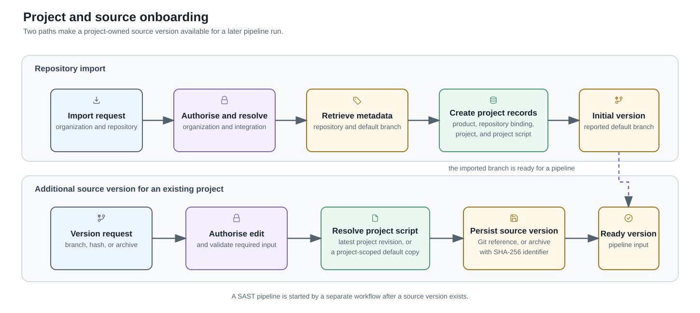

# Project and Source Onboarding

Project onboarding makes a source version available for later analysis. An
authorised caller can import a repository into an organization or add a source
version to an existing AIST project. Neither path starts a SAST pipeline.

## Import a repository

Repository import is available for configured
[GitHub](../integrations/github.md), [GitLab](../integrations/gitlab.md),
[Gerrit](../integrations/gerrit.md), and [Gitea](../integrations/gitea.md)
integrations. A caller chooses an organization and repository. AIST
checks access to that organization, retrieves repository metadata, and creates
or reuses the project records needed to represent the repository.

For a new project, AIST creates its initial project-scoped script and records
the repository's reported default branch as an initial `GIT_BRANCH` source
version. The project then has a source version that can be selected for a
pipeline run. When `auto_analyze` is requested, AIST separately queues initial
script and profile analysis after the import succeeds.

An import is rejected when the caller cannot use the target organization, no
active integration of the selected type exists, or the repository/product is
already owned by an incompatible organization or product type. Metadata lookup
failures are returned without creating a successful import result.

## Add a source version

An existing project can receive three version types:

- `GIT_BRANCH` identifies a branch.
- `GIT_HASH` identifies a commit or hash.
- `FILE_HASH` stores an uploaded ZIP or TAR archive. Its version identifier is
  derived from the archive's SHA-256 digest when the caller does not provide a
  value.

Creating a source version requires edit permission for its project. Git branch
and hash versions require a version value; an archive version requires an
archive. A version is unique within its project for its version type. New
versions receive a project-scoped script: the latest project revision when one
exists, otherwise a project-scoped copy of the shared default.

Archive extraction is deferred until AIST needs the source. Extraction verifies
every archive path remains below the version's extraction root and ignores TAR
links and device entries.

## Result

Both paths end with a project-owned source version. The next workflow,
[Pipeline execution](pipeline-execution.md), explains how a selected version is
analysed and how the resulting findings enter review.
