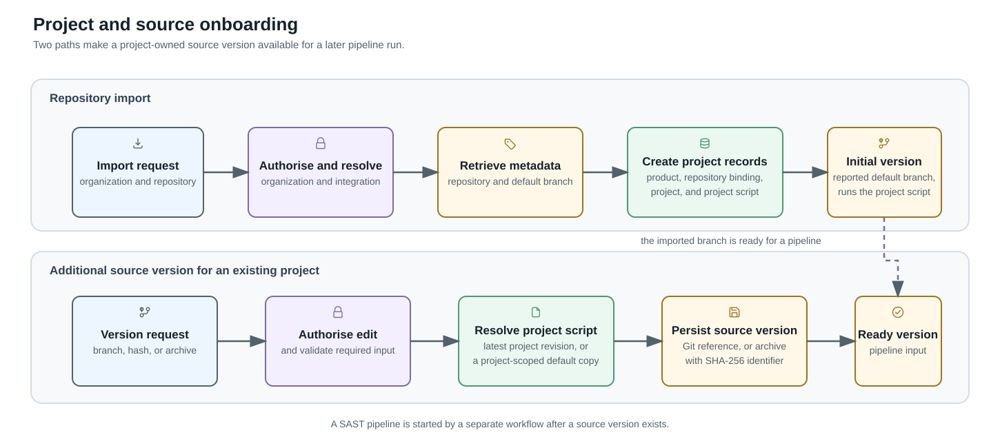

# Project and Source Onboarding

Project onboarding makes a source version available for later analysis. An
authorised caller can import a repository into an organization or add a source
version to an existing AIST project. Neither path starts a SAST pipeline.

## Import a repository

Repository import is available for configured
[GitHub](../integrations/github.md), [GitLab](../integrations/gitlab.md),
[Gerrit](../integrations/gerrit.md), and [Gitea](../integrations/gitea.md)
integrations. A caller chooses an organization and repository. AIST
checks access to that organization, retrieves repository metadata, and creates
or reuses the project records needed to represent the repository.

For a new project, AIST creates its initial project-scoped script and records
the repository's reported default branch as an initial `GIT_BRANCH` source
version that runs that script. The project then has a source version that can
be selected for a pipeline run. When `auto_analyze` is requested, AIST queues
[script and profile generation](#generate-an-initialization-script) for that
branch version once the import is committed. If the import created no branch
version, because the default branch was not reported or the project already
existed, nothing is queued; generation can be started later for a chosen
branch.

An import is rejected when the caller cannot use the target organization, no
active integration of the selected type exists, or the repository/product is
already owned by an incompatible organization or product type. Metadata lookup
failures are returned without creating a successful import result.

## Add a source version

An existing project can receive three version types:

- `GIT_BRANCH` identifies a branch.
- `GIT_HASH` identifies a commit or hash.
- `FILE_HASH` stores an uploaded ZIP or TAR archive. Its version identifier is
  derived from the archive's SHA-256 digest when the caller does not provide a
  value.

Creating a source version requires edit permission for its project. Git branch
and hash versions require a version value; an archive version requires an
archive. A version is unique within its project for its version type. New
versions receive a project-scoped script: the latest project revision when one
exists, otherwise a project-scoped copy of the shared default.

Archive extraction is deferred until AIST needs the source. Extraction verifies
every archive path remains below the version's extraction root and ignores TAR
links and device entries.

## Generate an initialization script

A project's initialization script prepares its source for build and analysis.
AIST can generate a project-specific script with the organization's Claude Code
integration. Generation always targets one `GIT_BRANCH` version: AIST clones
exactly that branch with the repository's credentials, through the project's VPN
when one is configured, then runs the analysis through the local AI bridge. The
generated script is stored as a project revision and assigned to that branch
version only; other versions keep their scripts. Path exclusions produced by
the same analysis apply to the whole project.

Generation runs automatically after an import with `auto_analyze`, or on demand
with **Regenerate** on the administrative AIST projects page (superusers only),
where the caller picks a branch version (newest first). The underlying API
requires permission to operate the
project ([Maintainer or Owner](../security/access-control-and-roles.md)), a
repository, and an active Claude Code integration. A version from
another project or organization is not found, and a hash or archive version is
rejected. The client UI has no Regenerate control.

## Which script a run uses

A pipeline runs its source version's own script, or the shared default when the
version has none. A branch run copies the branch's script to the commit version
it resolves, so a script assigned to a branch applies to its later runs. The
script shown for a version, and the project's active script (that of its latest
version), are exactly what that version's next pipeline runs; a project revision
that no version uses is never shown as active.

## Result

Both paths end with a project-owned source version. The next workflow,
[Pipeline execution](pipeline-execution.md), explains how a selected version is
analysed and how the resulting findings enter review.
