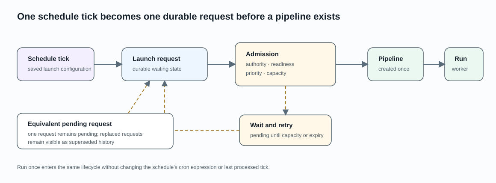

# Scheduled pipeline launches

A launch schedule runs one saved launch configuration at recurring cron times.
Each due tick first creates a durable launch request. A pipeline is created only
after the request is still authorized, ready, and within its execution
capacity.

## Configure the schedule

Each launch configuration can own one schedule with:

- a standard five-field cron expression;
- an enabled or disabled state;
- an execution capacity appropriate to its target. SAST schedules can use the
  configured bounded capacity; DAST schedules use exactly one slot for the
  integration.

The schedule preview shows upcoming times in the server's configured timezone.
Changing a schedule affects future ticks; it does not rewrite pipelines or
launch requests that already exist.

Creating or changing a schedule requires project-operate permission. Readers
who can access the project can view the schedule and its resulting pipeline
history.

## From a due tick to a pipeline

Celery Beat evaluates enabled schedules. For each unprocessed due tick, AIST
records one launch request containing the selected launch configuration and the
non-secret execution inputs needed to reproduce that request. Recording the
request does not start a scan.

Due schedules are claimed from the indexed next-run timestamp under a database
lock. The next tick is reserved before admission so concurrent Beat workers do
not process the same tick. If admission is rejected, the canonical due time and
a bounded error code and explanation remain on the schedule for the operator;
another schedule in the same batch can still proceed.

The dispatcher then:

1. confirms that the schedule and project authority are still valid;
2. resolves the execution target and checks its current readiness;
3. acquires a capacity lease or returns the request to the queue with bounded
   backoff;
4. creates an **Admitted** pipeline and its durable publish intent in one
   transaction;
5. publishes one generic task containing only the pipeline identity. The first
   accepted delivery marks the request **Dispatched** and the pipeline
   **Executing**.

Requests ready at the same time are considered by priority and then age. When
an equivalent request is already waiting, AIST preserves one pending request
and marks the replaced request as superseded rather than starting duplicate
work.

## Waiting and terminal states

| Launch-request state | Meaning for the reader |
|---|---|
| Pending | Waiting for its eligible time or a capacity retry |
| Claimed | Temporarily owned by a dispatcher while authority and readiness are checked |
| Planned | The pipeline, capacity lease, and publish intent are durable |
| Published | Broker publication is pending or recoverable; the worker has not accepted it |
| Superseded | Replaced by an equivalent pending request; no pipeline was started |
| Dispatched | The worker accepted the delivery and the pipeline is executing |
| Expired | Capacity was unavailable until the request deadline |
| Failed | Admission or durable hand-off failed; any created pipeline remains visible with warnings |
| Cancelled | Cancelled before worker acceptance, or a DAST execution ended by cancellation |

A capacity wait does not create an empty pipeline. A pipeline can appear while
the request is **Planned** or **Published**, but it remains **Admitted** until a
worker accepts the delivery. After that point, execution state and cancellation
belong to the pipeline.

## Run once

**Run once** queues the selected schedule immediately without changing its cron
expression or recorded last tick. It follows the same durable request,
authorization, capacity, and execution path as a scheduled tick.

See [pipeline execution](pipeline-execution.md) for the lifecycle after a
pipeline is created and [pipeline actions](pipeline-actions.md) for
notifications triggered by pipeline status.
