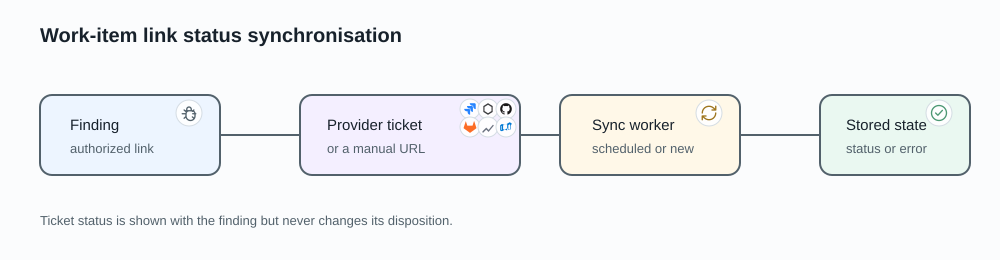

# Work-item links

A work-item link connects one AIST finding to a remediation ticket or a manual
URL. It gives reviewers delivery context without allowing the external ticket
to change the finding's security disposition.

## Link and provider ownership

A provider is an organization-owned connection to an external tracker. It holds
the provider type, base URL, non-secret settings, active and synchronization
state, and an encrypted token when the provider requires one.

A provider-backed link stores the external ticket identity, URL, title, raw
status, normalized status category, last refresh time, and any refresh error. A
manual link stores a URL and is never fetched. The provider and finding must
belong to the same organization.

## Supported providers

| Provider | Create link | Automatic status refresh |
|---|:---:|:---:|
| Jira | Yes | Yes |
| GitHub Issues | Yes | Yes |
| GitLab Issues | Yes | Yes |
| YouTrack | Yes | No; link-only |
| Linear | Yes | No; link-only |
| Azure DevOps | Yes | No; link-only |
| Generic or manual URL | Yes | No |

The provider pages describe credentials and provider-specific status mapping.
A link-only provider does not need a separate synchronization backend to retain
the URL and manually entered context.

## Status refresh

Creating a synchronized provider link queues its first refresh. Recurring work
then refreshes links for active providers with synchronization enabled. Each
ticket is processed independently, so one provider error or missing ticket does
not block its siblings.

The finding displays both the provider's status and AIST's normalized category.
Ticket state is informational: closing a ticket cannot close the finding,
accept its risk, or override a reviewer decision. A provider that requires
private connectivity uses its configured organization VPN route.

Readers can view links on findings they may access. Creating, changing, or
removing a link requires finding-edit permission. Managing provider credentials
requires organization-management permission.
