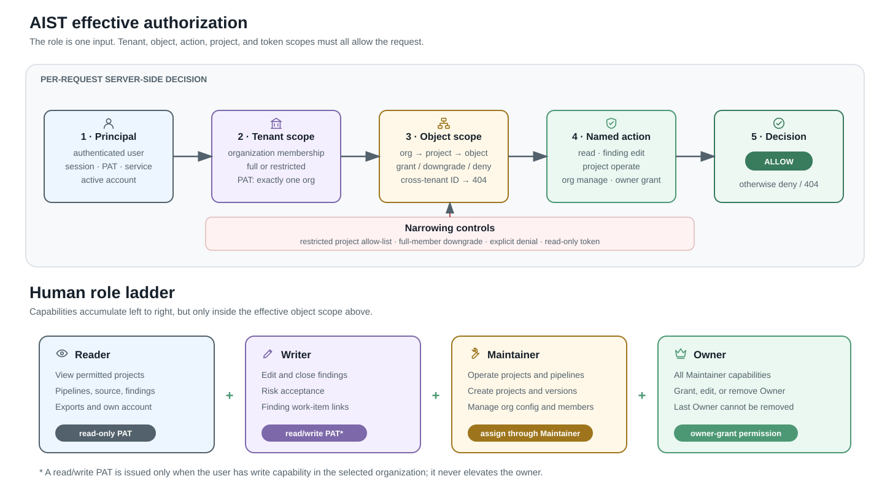
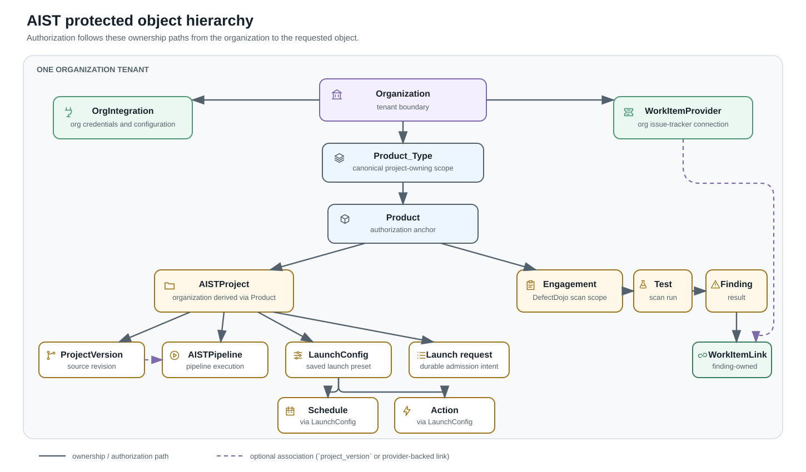

# Access control, roles, object permissions, and API tokens

This page is the reader-facing description of the access-control model enforced
by the AIST API. It describes the current implementation, not a future design
and not a compliance certification. The effective decision is a hybrid of
role-based access control (RBAC) and resource attributes:

> **Allow only when the authenticated principal, organization scope, object
> path, named action, role permission, project override, and token scope all
> allow the request. An explicit project denial wins.**



## Security properties

- Authorization is enforced by the server on every protected request. Client
  `PermissionGate` components only remove unavailable controls from the UI.
- Organization membership is the tenant boundary. A standalone project grant
  does not grant access outside an organization membership.
- Protected object lookup follows the ownership path from organization to
  project and then to versions, pipelines, tests, findings, launch settings,
  integrations, and work-item data. A guessed identifier outside the effective
  scope resolves as not found.
- AIST roles are hierarchical: `Reader < Writer < Maintainer < Owner`. Higher
  roles include the lower AIST capabilities listed on this page.
- Full organization access can be narrowed for one project without changing
  access to other projects. Restricted membership is an allow-list of projects.
- An AIST personal access token (PAT) is bound to one organization and can only
  reduce the permissions of its current owner.
- Non-superuser DefectDojo global roles are rejected by a Django security check.
  They are not an alternative path around AIST organization membership.

## Principals and authorization modes

| Principal or endpoint mode | Purpose | Authorization boundary |
|---|---|---|
| Human user with a session | Browser and interactive API use | Current organization/project role and object scope |
| Human user with an AIST PAT | Automation against the AIST API | Same current user permissions, intersected with one token organization and `read_only` or `read_write` scope |
| Superuser | Platform administration and recovery | Global bypass for AIST object querysets; an AIST PAT still narrows a superuser to its token organization |
| Internal service principal | Pipeline and AI callbacks that are not tenant-user CRUD | `INTERNAL_SERVICE`: authenticated superuser via session or stock DRF token; AIST PATs are rejected |
| `PUBLIC` endpoint mode | Login, self-scoped account/token operations, callbacks with their own validation, or non-tenant reference data | Does **not** mean every endpoint is anonymous; its explicit authentication and validation still apply |

`aist-service` is the provisioned internal-service account. Internal-service
authorization checks the authenticated account's `is_superuser` property; it
does not require that exact username. See
[Current limitations](#current-limitations).

## Role capability matrix

Every check mark assumes that the target object is inside the user's effective
organization and project scope. A role never makes an object from another
organization visible.

| AIST capability | Reader | Writer | Maintainer | Owner |
|---|:---:|:---:|:---:|:---:|
| View permitted projects, source versions/files, pipelines, logs, tests, findings, and finding exports | ✓ | ✓ | ✓ | ✓ |
| View own account and visible organization memberships | ✓ | ✓ | ✓ | ✓ |
| View the non-secret work-item provider list for a permitted organization | ✓ | ✓ | ✓ | ✓ |
| Edit finding fields, severity, status, notes, duplicate state, and bulk status | — | ✓ | ✓ | ✓ |
| Close/reopen findings and approve risk acceptance | — | ✓ | ✓ | ✓ |
| Create, update, or remove finding work-item links | — | ✓ | ✓ | ✓ |
| Create project versions and import a report | — | — | ✓ | ✓ |
| Start, stop, or delete pipelines; request or remove AI triage results | — | — | ✓ | ✓ |
| Manage project scripts, SCM links, integration overrides, launch configurations, schedules, actions, and queue entries | — | — | ✓ | ✓ |
| Create/import a project in an existing organization | — | — | ✓ | ✓ |
| View membership/integration management data; manage members, integrations, and work-item providers | — | — | ✓ | ✓ |
| Assign Reader, Writer, or Maintainer membership/project roles | — | — | ✓ | ✓ |
| Assign, edit, or remove an Owner role | — | — | — | ✓ |
| Create a `read_only` AIST PAT for a visible organization | ✓ | ✓ | ✓ | ✓ |
| Create a `read_write` AIST PAT | — | ✓* | ✓* | ✓* |
| Create a new organization | — | — | — | — |

\* A `read_write` PAT is available only when the user currently has
`Finding_Edit` on at least one project in the selected organization. The token
still cannot write to any other project or perform actions above the user's
effective role. Organization creation is a superuser-only platform operation;
it is deliberately not an Owner capability.

Role management has two additional guards:

- an actor cannot assign a full organization role higher than their own;
- editing/removing an Owner, assigning an Owner at organization or project
  level, and replacing an existing project Owner require the owner-grant
  permission; the last organization Owner cannot be demoted or removed.

The upstream `API_Importer` enum still exists for DefectDojo compatibility, but
it is intentionally excluded from AIST's assignable roles and management UI. It
must not be treated as an AIST role between Reader and Writer.

## Named actions and underlying permissions

Every protected AIST API class declares a resource policy. Safe HTTP methods use
the declared read action and mutating methods use the declared write action,
unless the endpoint explicitly declares a non-mutating POST. The central action
map is:

| Named AIST action | Underlying DefectDojo permission | Minimum AIST role | Typical protected objects/operations |
|---|---|---|---|
| `PRODUCT_READ` | `Product_View` | Reader | Product, AIST project, version, pipeline, source file, launch data |
| `FINDING_READ` | `Finding_View` | Reader | Finding lists, details, notes, work-item links |
| `TEST_READ` | `Test_View` | Reader | Test detail |
| `ENGAGEMENT_READ` | `Engagement_View` | Reader | Engagement detail |
| `ORG_MANAGE_READ` | `Product_Type_Manage_Members` | Maintainer | Membership and sensitive organization configuration reads |
| `FINDING_EDIT` | `Finding_Edit` | Writer | Finding mutations and work-item-link mutations |
| `RISK_ACCEPT` | `Risk_Acceptance` | Writer | Risk-acceptance approval |
| `PROJECT_OPERATE` | `Product_Edit` | Maintainer | Pipeline execution, project configuration, versions, imports |
| `PROJECT_CREATE` | `Product_Type_Add_Product` | Maintainer | SCM onboarding/project creation inside an existing organization |
| `ORG_MANAGE` | `Product_Type_Manage_Members` | Maintainer | Members, integrations, work-item providers |
| `OWNER_GRANT` | `Product_Type_Member_Add_Owner` | Owner | Organization Owner assignment |

The role is only the permission source. The object still has to be returned by
the corresponding organization-scoped queryset. Fine-grained membership code
also checks `Product_Member_Add_Owner` when a per-project Owner grant is touched.

## Object scope and project-level permissions

The canonical protected ownership paths are:



Solid arrows show ownership and the authorization path. Dashed arrows show an
optional association: a pipeline can reference a project version, and a
provider-backed work-item link can reference an organization provider. Manual
work-item links have no provider.

`AISTProject` does not carry a second organization field. Its organization is
derived from `project.product.prod_type`, avoiding two tenant identifiers that
could disagree.

### Full member

A full member receives the organization role on every project, with two local
ways to narrow it:

1. `ProjectAccessDenial` removes all access to that project.
2. A per-project `Product_Member` role replaces the organization role for that
   project and may only be equal or lower.

The downgrade cap is checked when a grant is written and again when objects are
read. A rogue higher project-role row created outside the AIST membership service
is ignored as an elevation and the full member falls back to the organization
role.

### Restricted member

A restricted member has a baseline organization membership but receives no
project access from it. Each explicit `Product_Member` grant is an allow-list
entry and defines that project's effective role; zero grants means zero visible
projects. Because the baseline Reader record is not an effective project role,
a restricted project's Writer or Maintainer grant is intentional role
assignment, not an override above Reader. Owner grants still require an Owner
actor.

Grant and revoke operations lock the target project row, so concurrent changes
cannot leave both an allow grant and denial as the accidental outcome. Resetting
a member to full access deliberately clears project grants and denials.

### Group-derived roles

Organization roles may also come from a DefectDojo product-type group. The
highest qualifying direct or group role supplies the permission, while the same
organization, object, restriction, denial, and token filters continue to apply.

## AIST personal access tokens

An AIST PAT has the wire prefix `aistpat_` and belongs to exactly one user and
one organization.

| Token property | `read_only` | `read_write` |
|---|---|---|
| Who can create it | Any authenticated user for a visible organization | User with current Writer-or-higher capability on at least one project in that organization |
| Read requests | Allowed when the owner's current role and object scope allow | Allowed when the owner's current role and object scope allow |
| Mutating requests | Denied, except endpoints explicitly classified as non-mutating POST reads | Evaluated against the owner's current named-action permission and object scope |
| Tenant reach | Exactly the token's organization | Exactly the token's organization |
| Vendor `/aist-admin/` API | Rejected | Rejected |
| Internal-service endpoints | Rejected | Rejected |

Token lifecycle and storage controls:

- the plaintext token is returned exactly once at creation;
- only a Django password-hasher digest, a public lookup identifier, and the last
  four secret characters are stored;
- expiry is optional but, when configured, is checked on every authentication;
- the owner can delete their token; removing the owner from an organization
  revokes every still-active PAT for that organization;
- a disabled account, expired token, or revoked token cannot authenticate;
- `last_used_at` is recorded, with writes throttled to at most once per minute;
- roles and project scope are queried again for each request, so a PAT does not
  retain rights removed from its owner.

A PAT is a bearer credential. `read_write` means that the token may attempt
unsafe HTTP methods; it is **not** a grant of every write action. Effective
access remains the intersection:

```text
owner's current role permissions
AND token organization
AND full/restricted project scope
AND object ownership path
AND token read/write scope
```

## Enforcement points

- [`aist/authz/policy.py`](../../aist/authz/policy.py) is the single named
  action-to-permission and resource-to-queryset map.
- [`aist/authz/base.py`](../../aist/authz/base.py) requires every concrete AIST
  API class to declare `ResourcePolicy`, `PUBLIC`, or `INTERNAL_SERVICE` at
  import time and supplies the tenant-scoped object resolver.
- [`aist/queries.py`](../../aist/queries.py) computes effective organization,
  project, nested-object, group, superuser, and token scope.
- [`aist/members/service.py`](../../aist/members/service.py) owns membership,
  role assignment, project grants/denials, last-Owner safety, and membership
  removal.
- [`aist/authentication.py`](../../aist/authentication.py),
  [`aist/api/tokens.py`](../../aist/api/tokens.py), and
  [`aist_site/middleware.py`](../../aist_site/middleware.py) implement PAT
  authentication, lifecycle, one-organization binding, and method scope.
- [`aist/checks.py`](../../aist/checks.py) rejects non-superuser global roles.

## Standards alignment

This mapping explains design alignment; it is not evidence of certification.

| Standard or guidance | AIST implementation alignment |
|---|---|
| [OWASP ASVS 5.0, V8 Authorization](https://github.com/OWASP/ASVS/blob/v5.0.0_release/5.0/en/0x17-V8-Authorization.md) | Named function permissions, data-specific object queries, server-side enforcement, and explicit cross-tenant controls address V8.1.1, V8.2.1, V8.2.2, V8.3.1, and V8.4.1. |
| [OWASP Authorization Cheat Sheet](https://cheatsheetseries.owasp.org/cheatsheets/Authorization_Cheat_Sheet.html) | Least privilege, deny-by-default endpoint declarations, validation on every request, object-level checks, and authorization test coverage are explicit design goals. |
| [OWASP API1:2023 Broken Object Level Authorization](https://owasp.org/API-Security/editions/2023/en/0xa1-broken-object-level-authorization/) | IDs are resolved through permission-filtered, tenant-scoped querysets instead of unrestricted model lookup. |
| [OWASP API5:2023 Broken Function Level Authorization](https://owasp.org/API-Security/editions/2023/en/0xa5-broken-function-level-authorization/) | Each endpoint declares a named read/write action; role and action checks are server-side. |
| [NIST RBAC](https://csrc.nist.gov/Projects/Role-Based-Access-Control) / INCITS 359-2012 | Reader, Writer, Maintainer, and Owner form a role hierarchy that assigns permissions over operations and objects. |
| [NIST SP 800-162, Attribute Based Access Control](https://csrc.nist.gov/pubs/sp/800/162/upd2/final) | The RBAC result is intersected with subject attributes (membership, group, superuser), object attributes (ownership path), action, project scope, denial, and token organization. |
| [NIST SP 800-207, Zero Trust Architecture](https://csrc.nist.gov/pubs/sp/800/207/final) | Network location does not grant tenant access; the principal, action, and resource are authenticated/authorized for each request. |
| [IETF RFC 9700 section 2.3, Access Token Privilege Restriction](https://www.rfc-editor.org/rfc/rfc9700.html#section-2.3) | AIST PATs apply minimum-privilege ideas through organization and read/write restriction. They are proprietary PATs, not OAuth access tokens, so this is principle alignment rather than OAuth conformance. |

## Current limitations

- `INTERNAL_SERVICE` authorizes any authenticated superuser using a session or
  stock DRF token. The deployment intends `aist-service`, but the authorization
  barrier is not cryptographically bound to that service identity.
- AIST PATs are bearer tokens: they are not sender-constrained, do not carry an
  OAuth audience, and can be replayed if stolen until expiry, deletion, account
  disablement, or membership removal.
- PAT expiry is optional and has no enforced maximum lifetime. Rotation is
  replace-and-delete rather than an automatic rotation protocol.
- PAT scopes are deliberately coarse (`read_only` or `read_write`). They do not
  select individual actions, projects, source IPs, devices, or time windows;
  role and object authorization provide the finer boundary.
- Superuser is an intentionally broad break-glass/platform-administration
  bypass. Separation of duties, approval workflow, and just-in-time elevation
  for superuser access are operational controls outside this role model.
- The server re-evaluates current authorization on each request, but the model
  does not make contextual risk (device posture, request origin, or behavioral
  signals) part of the decision.
