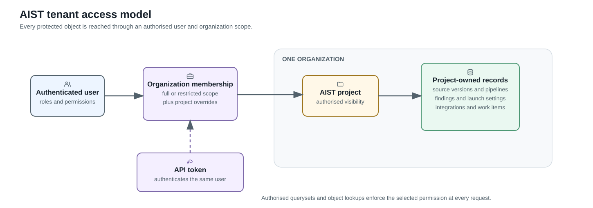

# Tenant isolation and access

An AIST organization is the tenant boundary for projects, findings,
integrations, credentials, and work-item providers. This page explains how data
stays inside that boundary. The complete role and permission behavior is in
[access control and roles](access-control-and-roles.md).



## Ownership path

Protected project data is reached through one ownership path:

```text
Organization → ProductType → Product → AIST project
             → source versions, pipelines, tests, findings, and launch settings
```

Organization integrations, credentials, and work-item providers belong directly
to the organization. A project binding may reference one of those resources only
when both sides resolve to the same organization.

An object identifier is never sufficient by itself. The API first narrows the
available queryset by the caller's organization, project access, and requested
permission, then resolves the identifier inside that scope. An object owned by
another tenant is therefore not exposed as an accessible record.

## Full and restricted membership

A full member receives the organization role across its projects. A project
override can lower that role or deny the project, but cannot elevate the
organization role.

A restricted member receives no project access from the baseline organization
membership. Each explicit project grant is an allow-list entry and defines the
role for that project; it may intentionally be Writer or Maintainer. Owner
grants retain the separate Owner permission gate.

## Tokens and delayed work

An AIST personal access token belongs to one user and one organization. Its
authority is the intersection of that organization, method scope, expiry and
revocation state, and the owner's current role and project access.

Queued work does not inherit unrestricted worker authority. Before a delayed
operation crosses an execution or external-provider boundary, AIST re-resolves
the stored tenant-owned objects and revalidates the authority represented by the
request. Revoked or inconsistent authority fails the operation.

## External integrations

Repository bindings, DAST targets, VPN routes, and work-item links preserve the
same organization on both sides of the relationship. Provider credentials grant
access to the provider only; they do not grant additional AIST project access.

See [VPN-routed operations](../data-flows/vpn-routed-operations.md) for the
network path and [security boundaries](threat-register.md) for residual trust
assumptions.
