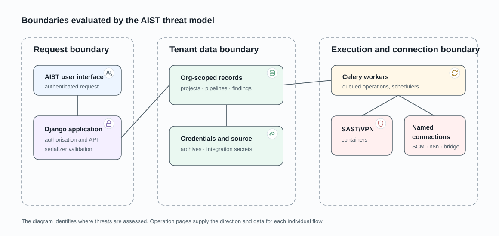

# Security boundaries and trust assumptions

This public threat model describes the assets AIST protects, where untrusted
data crosses a boundary, the security property expected at that boundary, and
the trust that remains with operators or external providers. It is not a list
of active vulnerabilities or a claim of certification.

Suspected vulnerabilities, affected implementation paths, reproduction, and
remediation status are handled privately according to the repository
[security policy](../../SECURITY.md).

## Assets and actors

Protected assets include tenant source code, findings, review decisions,
integration credentials, scan results, and the authority to start or alter
work.

Relevant actors are authenticated users, organization administrators,
deployment operators, external providers, and the untrusted source or report
content processed by scan workloads.

## Boundary model

| Threat scenario | Security property | Residual trust or responsibility |
|---|---|---|
| A user presents an identifier owned by another organization or project | Object lookup is constrained by current tenant, project access, and named permission | Every new endpoint and relationship requires authorization review and cross-tenant tests |
| A bearer token is copied or its owner's access changes | The token is limited to one organization and current owner authority; expiry and revocation are checked on use | Tokens must be protected and rotated; they are not sender-constrained |
| Source archives, repositories, or reports contain hostile input | Parsing and execution occur through bounded import or isolated workload boundaries before durable findings are accepted | An analyzer or provider can still produce inaccurate results; operators choose which providers and images to trust |
| An integration points AIST at an external or private destination | The organization owns the integration, credentials, and optional VPN route; the consumer selects the route from authorized state | Administrators control the provider endpoint and private ranges made reachable by the VPN |
| A queued task is duplicated, delayed, or executes after access changes | Durable state is authoritative; sensitive transitions revalidate stored authority and accept one execution identity | Database, broker, worker, or provider outages can delay cancellation and terminal observation |
| A scan, connector, or local AI operation attempts to affect the application host | Workloads run in operation-specific containers without privileged or host-network execution | Workers and the local AI bridge have Docker-daemon access and remain privileged host components requiring isolated, hardened hosts |
| A source-analysis request names a file outside its pipeline workspace | The context extractor receives an authorized active pipeline root, validates requested paths beneath it, and mounts project workspaces read-only | The internal service token and integrity of the mounted workspace remain deployment trust assumptions |
| A callback or provider result references the wrong run or tenant object | Callback authentication is combined with stored object identity and ownership validation | Service credentials and conforming external providers remain privileged trust relationships |

## Public and private records

Public documentation should state stable security properties, trust boundaries,
and durable limitations that help administrators deploy and use AIST safely. It
must not publish an unpatched exploit path or work-in-progress remediation.

The private security record owns active findings, exact affected paths,
reproduction, severity, remediation status, and coordinated disclosure. Public
pages are updated after the security property changes or disclosure is safe.

Related pages: [access control and roles](access-control-and-roles.md),
[tenant isolation](tenant-isolation-and-access.md),
[runtime deployment](../architecture/runtime-deployment.md), and
[VPN-routed operations](../data-flows/vpn-routed-operations.md).
