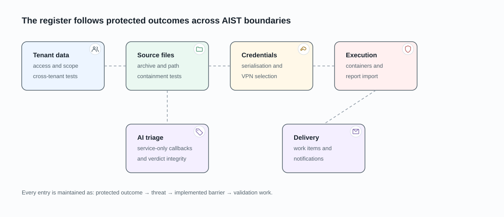

# Threat Register

This register is the current security baseline for the flows documented in
this repository. Each entry identifies the protected outcome, the threat, the
implemented barrier, and the next validation work. It is deliberately concise:
the product and data-flow pages hold the operational detail.

## Tenant data exposure

**Protected outcome:** a user can read or change only the organization and
project records that their effective role permits.

**Threat:** identifier guessing, nested-object lookup, bulk endpoints, or a
background lookup returns another organization's project, version, pipeline,
finding, integration, work-item link, or AI response.

**Implemented barrier:** AIST API views resolve protected objects from
permission-specific authorised querysets. The underlying product query requires
organization membership, applies restricted or full project scope, and applies
per-project denials and role caps. The tenant model is documented in
[tenant isolation and access](tenant-isolation-and-access.md).

**Validation:** add a cross-organization negative test whenever a new endpoint,
serializer relation, task lookup, or callback can reach organization-owned data.

## Untrusted source and file paths

**Protected outcome:** an archive or file request cannot read or write outside
its project-version source root.

**Threat:** traversal names, symlinks, special archive members, or a file path
that escapes the extracted archive directory.

**Implemented barrier:** archive extraction resolves each member beneath the
extraction root and rejects traversal. Tar symbolic links, hard links, devices,
and FIFOs are skipped.

**Open validation item:** the file-serving path resolves `root / subpath` but
does not itself compare the resolved result with `root` before opening it. Add
a decoded traversal test and enforce the same containment check used by archive
extraction before treating this boundary as closed.

## Integration and VPN credentials

**Protected outcome:** integration secrets are not disclosed through the UI or
API and are used only by the selected organization's operation.

**Threat:** response serialization leaks a token, an integration references a
different organization's VPN credentials, or credentials remain accessible
after an execution ends.

**Implemented barrier:** integration and VPN credential fields are encrypted at
rest and write-only in the API; responses expose only presence indicators. VPN
references on integrations and work-item providers are validated against the
same organization. Pipeline sidecars are execution-specific; interactive file
access uses a separately named, bounded warm-egress pool.

**Validation:** cover secret omission in every response serializer and test
cross-organization VPN reference rejection for each configuration path.

## Container execution and imported reports

**Protected outcome:** untrusted source and analyzer output cannot escape the
intended run workspace or silently change another pipeline's data.

**Threat:** hostile repository content drives a builder/analyzer container into
host-impacting behaviour, report files collide between runs, an imported
report is applied to the wrong pipeline, or an attacker-crafted report
uploaded through the manual report-import path is treated as trusted scan
output.

**Implemented barrier:** the platform allocates a pipeline-specific output
directory; runtime container names include the pipeline identifier; pipeline
status and pipeline records are locked while key transitions are applied. The
manual report import scopes its project relation to the caller's project-edit
permissions, restricts `scan_type` to the registered parser set, delegates
content validation to that parser, caps upload size, and applies a per-user
rate limit. The shared import wrapper unlinks endpoints carrying schemes
outside `http` and `https`. The backend treats report endpoint and reference
URLs as data. The client creates links for `http` and `https` reference lines
with opener isolation and renders other reference values as text. See
[DAST integration](../integrations/dast.md).

**Open review item:** the builder runtime mounts the Docker socket. This is a
high-impact boundary and needs a dedicated deployment review of image trust,
socket exposure, container user, mounts, network policy, and host isolation.

## AI triage callbacks and verdict integrity

**Protected outcome:** a callback changes only its intended pipeline and only
valid findings receive an AI response.

**Threat:** a forged or replayed callback finishes a pipeline, persists an
untrusted payload, or associates a verdict with an unrelated finding.

**Implemented barrier:** callbacks require an authenticated request, lock and
load the target pipeline, and response synchronisation drops returned findings
that cannot be matched to existing findings. Local completion checks whether
responses already exist before deciding the final degraded state.

**Validation:** test the authentication mechanism and replay behaviour in the
deployed callback path, then test callback payloads containing another
pipeline's finding identifiers.

## Work-item and notification delivery

**Protected outcome:** delivery failures remain visible and a linked work item
cannot alter the finding's security disposition.

**Threat:** an unavailable provider hides an error, a provider sync aborts all
links, or notification delivery is mistaken for remediation.

**Implemented barrier:** each provider-backed link synchronises independently
and persists `sync_error`; manual links are not fetched. Notification actions
record an action result on the pipeline and do not update finding review state.

**Validation:** test provider failure alongside a successful sibling link and
verify that action delivery cannot mutate a finding or risk-acceptance record.
